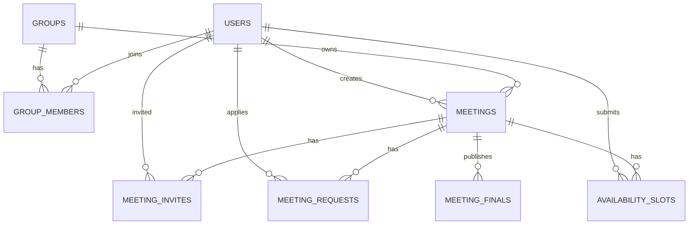

# Meeting Collaboration Design

## Goal

Add a standalone team-meeting coordination feature to the existing collaboration platform. This module is independent from projects and focuses on small-group membership, meeting invitations, availability collection, real-time overlap calculation, and final publishable meeting decisions.

## Scope

### In scope
- Create independent groups.
- Invite existing users into a group.
- Create meeting reservations inside a group.
- Invite only group members to a meeting.
- Allow non-invited group members to request to join a meeting.
- Collect availability from invited or approved attendees.
- Compute the intersection of currently submitted availability slots without waiting for everyone.
- Show attendees, location, and availability in real time.
- Allow the meeting creator to publish final meeting details.
- Keep the published final details editable only by the meeting creator.
- Make final published information read-only for everyone else.

### Out of scope
- Project-linked groups or project-linked meetings.
- Public group discovery or public join requests.
- Calendar sync with Google/Outlook.
- Email/SMS reminders.
- Recurring meetings.
- Fine-grained room/resource booking integration.

## Product Principles

- Keep the feature independent from project management.
- Use group membership as the only gate for meeting participation.
- Treat the meeting creator as the only editor of final published details.
- Compute and display the availability intersection from only the users who have already submitted availability.
- Preserve a historical snapshot of the final meeting so later edits do not destroy the published record.

## Current State

The existing application already has:
- User accounts and authentication.
- Project membership and access control.
- Tasks, documents, and files tied to projects.
- Real-time Socket.IO infrastructure for collaborative document editing.

The new meeting module should not depend on project membership or project-level permissions.

## Proposed Data Model

### Group
A standalone collection of users.
- `id`
- `name`
- `description`
- `owner_id`
- `created_at`
- `updated_at`

### GroupMember
Membership row linking a user to a group.
- `id`
- `group_id`
- `user_id`
- `role` (`owner`, `admin`, `member`)
- `joined_at`

### Meeting
Represents a meeting reservation inside a group.
- `id`
- `group_id`
- `creator_id`
- `title`
- `location`
- `planned_date`
- `planned_time_range`
- `status` (`draft`, `inviting`, `collecting`, `calculating`, `finalized`)
- `created_at`
- `updated_at`

### MeetingInvite
Tracks invited users.
- `id`
- `meeting_id`
- `user_id`
- `invite_status` (`pending`, `accepted`, `declined`)
- `created_at`
- `updated_at`

### MeetingRequest
Tracks join requests from group members who were not invited.
- `id`
- `meeting_id`
- `user_id`
- `request_status` (`pending`, `approved`, `rejected`)
- `created_at`
- `updated_at`

### AvailabilitySlot
Availability submitted by an invited or approved participant.
- `id`
- `meeting_id`
- `user_id`
- `available_date`
- `time_range`
- `created_at`
- `updated_at`

### MeetingFinal
Published final meeting snapshot.
- `id`
- `meeting_id`
- `final_creator_id`
- `final_location`
- `final_date`
- `final_time_range`
- `final_attendees_snapshot`
- `published_at`
- `updated_at`

## Relationship Diagram

## Meeting Flow

1. A registered user creates a group.
2. Group members invite other users into the group.
3. A group member creates a meeting inside the group.
4. The creator selects which group members to invite.
5. Non-invited group members may request to join the meeting.
6. The creator approves or rejects requests.
7. Invited or approved participants submit available date + time ranges.
8. The system recomputes the intersection of submitted availability in real time.
9. The creator publishes the final location, date, time range, and attendee list.
10. After publishing, only the creator may modify the final snapshot; other users have read-only access.

## Availability Rules

- Availability input uses day + time-range granularity.
- The system computes intersection only among users who have already submitted availability.
- The system does not wait for all invited users to submit before showing useful results.
- If there is no overlap, the UI should show that no common slot is currently available.

## Permission Rules

### Groups
- Only group members can invite other users into the group.
- Group membership is controlled by invitation from existing members.

### Meetings
- Only group members can create meetings.
- Only group members can be invited.
- Only group members can request to join a meeting.
- Only the meeting creator can publish or edit the final snapshot.
- After final publish, all non-creators are read-only.

## UI Plan

Add a new navigation entry: `会议`

The page should include:
- `我的小组`
  - Group list
  - Create group action
  - Group member list
- `会议预约`
  - Create meeting form
  - Invite list selector
  - Join request queue
- `可参会时间`
  - Per-user availability submissions
  - Current intersection preview
- `最终结果`
  - Final attendee list
  - Final location
  - Final date/time
  - Publish/edit controls for the creator only

## Data Integrity Notes

- Final published meeting data must be stored as a snapshot.
- The snapshot should not depend on the live invite/request/availability tables after publish.
- Availability rows may continue to change before publish, but the final snapshot must remain stable once published.
- A meeting should be able to transition from draft to finalized multiple times if the creator edits and republishes, but each publish action should overwrite only the creator-owned final record for that meeting.

## Suggested Implementation Order

1. Add the new database models.
2. Add the group and meeting API routes.
3. Add the availability intersection logic.
4. Add the new navigation entry and meeting page.
5. Add the final publish/edit flow.
6. Add tests for permissions, intersection calculation, and read-only final state.

## Acceptance Criteria

- A user can create a standalone group.
- A group member can create a meeting.
- Only group members can be invited.
- Non-invited group members can request to join.
- Approved or invited users can submit availability.
- The UI shows the current intersection of submitted availability.
- The creator can publish final meeting details.
- After publish, only the creator can edit the final state.
- Other users can only view the final state.
