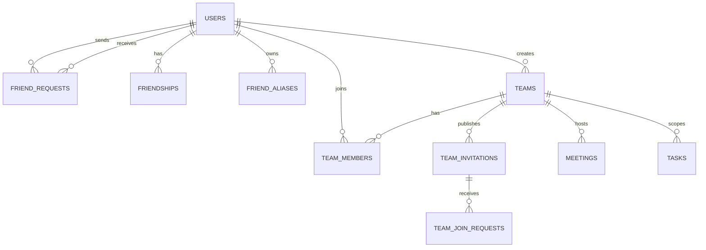

# Social Collaboration And Visibility Design

## Goal

Strengthen the collaboration foundation of the platform so that people, teams, tasks, and meetings operate on clear relationship boundaries instead of global user visibility.

This design introduces:
- a friend request system,
- private friend aliases,
- team creation and recruitment flows,
- scoped visibility rules,
- and shared selection rules for tasks, meetings, and future collaboration features.

## Why This Is P0

The current system has three structural problems:
- users can effectively discover too many other users too easily,
- team collaboration is incomplete because team creation and membership flows are not fully exposed to users,
- task and meeting collaboration lack a trustworthy relationship graph to determine who can see or invite whom.

Without fixing these, every new collaboration feature will continue to bolt onto a weak identity and permission model.

## Product Principles

- Friendship is a global relationship, not a prerequisite for all collaboration.
- Team membership creates a local collaboration context.
- Users who are not friends can still collaborate if they share a team.
- Visibility must always be evaluated in context, not only globally.
- Private aliases belong to the viewer, not to the viewed user.
- Selection lists should never be backed by the global user table directly.

## Key Visibility Rules

There are three different kinds of visibility in the system.

### 1. Global visibility

Controlled by friendship.

If user A and user B are friends:
- they appear in each other's contact lists,
- they can invite each other directly to future teams when friend-only selection is required,
- they can see each other in friend-scoped pickers.

### 2. Team-context visibility

Controlled by shared team membership.

If user A and user B are members of the same team:
- they are visible to each other inside that team,
- they can be selected in that team's task, meeting, and collaboration flows,
- they do not automatically become friends.

This means team membership creates local visibility without granting global friendship.

Example:
- A is friends with B.
- A is friends with C.
- B and C are not friends.
- A creates a team and adds B and C.
- Inside that team, B and C can see each other and collaborate.
- Outside that team, B and C are still not global contacts.

### 3. Published-invitation visibility

Controlled by the publisher when a team invitation is announced.

Supported scopes:
- visible to everyone,
- visible to friends only,
- visible to selected teams only, with multi-select.

This visibility affects who can discover and apply to a published team invitation. It does not automatically create friendship.

## Proposed Relationship Model

## Data Model

### User

Existing model, with one required addition:
- `friend_code`

Rules:
- generated automatically,
- globally unique,
- immutable,
- searchable.

### FriendRequest

Tracks pending friend applications.
- `id`
- `requester_id`
- `receiver_id`
- `status` (`pending`, `accepted`, `rejected`, `cancelled`)
- `created_at`
- `updated_at`

Rules:
- only active users can send requests,
- a user cannot send a request to self,
- duplicate pending requests between the same two users are blocked.

### Friendship

Represents an accepted global contact relationship.
- `id`
- `user_a_id`
- `user_b_id`
- `created_at`

Rules:
- one row per friendship pair,
- symmetric by design,
- deletion removes global contact visibility but does not affect team membership.

### FriendAlias

Viewer-owned private remark for a friend.
- `id`
- `owner_user_id`
- `target_user_id`
- `alias`
- `created_at`
- `updated_at`

Rules:
- only visible to `owner_user_id`,
- only allowed when owner and target are friends,
- used in every people-picker in the UI.

### Team

The renamed and expanded collaboration container currently approximated by `group`.
- `id`
- `name`
- `description`
- `creator_id`
- `visibility_mode` (`private`, `published`)
- `created_at`
- `updated_at`

Notes:
- the existing `group` implementation can be migrated into `team`,
- product language should standardize on `team` even if internal migration is staged.

### TeamMember

Membership inside a team.
- `id`
- `team_id`
- `user_id`
- `role` (`owner`, `admin`, `member`)
- `status` (`invited`, `active`, `removed`)
- `invited_by_id`
- `joined_at`
- `created_at`
- `updated_at`

Rules:
- `owner` and `admin` can approve published join requests,
- team membership creates local visibility even without friendship.

### TeamInvitation

Published recruitment post for joining a team.
- `id`
- `team_id`
- `publisher_id`
- `title`
- `description`
- `visibility_scope` (`public`, `friends`, `selected_teams`)
- `published_at`
- `expires_at`
- `status` (`active`, `closed`)

### TeamInvitationScope

Only used when `visibility_scope = selected_teams`.
- `id`
- `team_invitation_id`
- `target_team_id`

This enables multi-select team visibility.

### TeamJoinRequest

Application to join a published team invitation.
- `id`
- `team_invitation_id`
- `team_id`
- `applicant_id`
- `status` (`pending`, `approved`, `rejected`)
- `note`
- `decided_by_id`
- `decided_at`
- `created_at`
- `updated_at`

## Contact Discovery Rules

### Allowed discovery methods

Any active user can:
- search by `friend_code`,
- search by username.

### What discovery returns

Search results should not expose the whole user base as a rich contact list.

Each result should expose only minimal identity:
- username,
- friend code,
- avatar placeholder if present,
- current relationship state (`none`, `pending_sent`, `pending_received`, `friend`, `same_team_only`).

### What discovery does not imply

Discovery is not the same as collaboration permission.

Finding a user by `friend_code` or username does not mean:
- they become globally visible,
- they can immediately be assigned to tasks,
- they can immediately be invited into every team.

## Shared Selection Rules

All people-pickers should be backed by a common selection policy.

### In global friend-scoped pickers

Allowed candidates:
- accepted friends only.

Display:
- primary label is private alias if present,
- original username is shown in hover card or detail view,
- friend code is shown in detail view.

### In team-scoped pickers

Allowed candidates:
- active members of that team.

This includes:
- friends,
- non-friends who share the team.

Display:
- primary label is viewer alias if the candidate is also a friend,
- otherwise primary label is username,
- detail view shows relationship badges such as `friend` or `same team`.

### In published invitation scope selectors

Allowed candidates:
- teams where the publisher is `owner` or `admin`.

## Team Creation And Growth Flows

### Private team creation

Flow:
1. A user creates a team.
2. The creator becomes `owner`.
3. The creator may invite friends directly.
4. Invited users become active members when accepted.

### Team-context expansion

A member does not need to be a friend of every other team member.

If A adds B and C to the same team:
- B and C become visible to each other inside team workflows,
- B and C can collaborate on team-scoped tasks and meetings,
- B and C still remain non-friends globally unless they explicitly add each other.

### Published recruitment

Flow:
1. `owner` or `admin` publishes a team invitation.
2. Publisher chooses one visibility scope:
   - public,
   - friends only,
   - selected teams.
3. Eligible users can view the invitation and apply.
4. `owner` or `admin` approves or rejects each request.
5. Approved applicants become active team members.

## Task Collaboration Rules

Tasks should no longer depend only on project membership.

Future task assignment must support:
- assigning a friend in global contexts,
- assigning any active team member in team-scoped contexts,
- showing aliases in every assignee picker,
- preserving local team visibility without forcing friendship.

Task selection policy:
- project task: project member rule still applies,
- team task: team member rule applies,
- direct personal task: friend rule applies.

## Meeting Collaboration Rules

Meetings should be team-scoped by default.

Participation rules:
- creator can invite active team members,
- non-invited active team members can request to join if the meeting allows requests,
- only invited or approved users can submit availability,
- aliases should appear in attendee and availability views when applicable.

This tightens the current logic, which is broader than the intended flow.

## Notification And Inbox Requirements

The platform needs a unified pending-actions center for:
- incoming friend requests,
- outgoing friend requests,
- team invitations,
- published team join requests requiring approval,
- meeting invitations,
- meeting join requests requiring approval.

Without this, the new relationship model will exist in the database but feel broken to users.

## Navigation And UI Changes

### New or expanded navigation sections

- `联系人`
  - friend search by username or friend code,
  - incoming and outgoing friend requests,
  - friend list with private aliases.

- `Teams`
  - create team,
  - manage members,
  - publish team invitations,
  - review join requests.

- `会议`
  - team-scoped meetings only,
  - attendees selected from visible team members,
  - alias-aware attendee display.

### Alias display rule

Primary label:
- alias if present.

Secondary/hover detail:
- original username,
- friend code,
- relationship badges.

## Migration Notes

The current `group` model and routes should be treated as an early team implementation.

Recommended migration strategy:
1. Keep existing tables temporarily.
2. Introduce product language and UI as `team`.
3. Add the new friendship and invitation tables.
4. Refactor selection logic to use visibility policy instead of global user search.
5. Tighten meeting and task flows after visibility is in place.

## Suggested Implementation Order

1. Add `friend_code` to users.
2. Add friend request, friendship, and alias tables plus APIs.
3. Build the contacts UI and unified people-picker contract.
4. Upgrade `group` into `team` in product language and permissions.
5. Add published team invitation and join-request flows.
6. Refactor meeting participation to use team-scoped visibility rules.
7. Refactor task assignment to use friend/team-scoped visibility rules.
8. Add notification/inbox surfaces for all pending actions.

## Acceptance Criteria

- Every active user has an immutable global friend code.
- Active users can search by username or friend code and send friend requests.
- Accepted friends become globally visible contacts.
- Each user can store a private alias for each friend.
- Aliases appear as the primary label in every people-picker when applicable.
- Users who are not friends but share a team are visible to each other within that team.
- Team invitations can be published with visibility set to public, friends only, or selected teams.
- Selected-team visibility supports multi-select.
- Team `owner` and `admin` can approve join requests.
- Meeting and future team-scoped task collaboration use team visibility, not only friendship.
- Shared team membership does not automatically create friendship.
